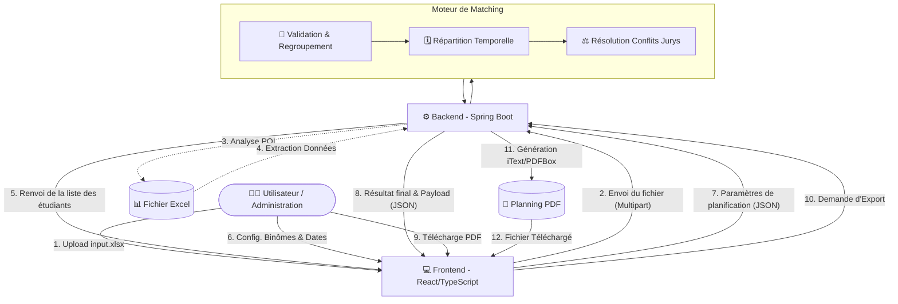

# 🎓 PFE Matcher - Système de Planification des Soutenances


**PFE Matcher** est une application Full-Stack conçue pour résoudre le problème de planification et de répartition des soutenances de Projets de Fin d'Études (PFE). Elle automatise le traitement des données Excel, la création des binômes, la vérification des disponibilités des jurys, et la génération d'un planning optimal exportable en PDF.

---

## 🌟 Fonctionnalités Clés

- **Traitement Automatisé** : Lecture et extraction automatique des étudiants, encadrants et sujets depuis un fichier Excel (`.xlsx`).
- **Gestion des Binômes** : Interface intuitive permettant de regrouper les étudiants en binômes ou de les laisser en soutenance individuelle.
- **Configuration Flexible** : Définition des dates (Début/Fin) et des créneaux horaires (Matin / Après-midi) pour restreindre les soutenances.
- **Génération Intelligente** : Algorithme backend qui génère un planning cohérent en évitant les conflits de jurys (professeurs).
- **Exportation PDF** : Téléchargement du planning final sous forme de document PDF formaté avec un code couleur.

---

## 🏗 Architecture & Pipeline de Traitement

Le projet suit une architecture client-serveur avec un traitement en 5 étapes.



### Explication des étapes :

1. **Étape 1 : Ingestion des Données**  
   L'utilisateur importe le fichier `input.xlsx` via le Frontend. Le Backend (via Apache POI) analyse les feuilles de calcul, extrait les paramètres et enregistre les données temporairement.
2. **Étape 2 : Configuration Utilisateur (Binômes)**  
   L'utilisateur définit la stratégie de soutenance dans l'UI (qui passe avec qui).
3. **Étape 3 : Définition Temporelle**  
   Saisie des contraintes de temps (ex: Du 1 Juin au 6 Juin, de 09:00 à 12:00 et 14:00 à 18:00).
4. **Étape 4 : Moteur de Matching (Pipeline)**  
   Création du planning optimal : Affectations -> Planification dans les créneaux -> Évitement des conflits de Professeurs.
5. **Étape 5 : Restitution**  
   Affichage interactif et téléchargement du planning finalisé au format PDF.

---

## 💻 Technologies Utilisées

### Frontend

- **React.js** (via Vite) pour une UI ultra-rapide.
- **TypeScript** pour la robustesse et le typage strict.
- **Bootstrap / CSS3** pour le design responsif et les composants.
- **Axios** pour les appels API.

### Backend

- **Java / Spring Boot** pour l'API REST.
- **Apache POI** pour la lecture et manipulation du format Excel.
- **Lombok** pour la réduction du code boilerplate.
- **iText / PDFBox** (ou équivalent) pour la génération de rapports en PDF.
- **Maven** pour la gestion des dépendances et du build.

---

## 🚀 Installation & Démarrage

### Prérequis

- [Node.js](https://nodejs.org/) (v18+)
- [Java Development Kit (JDK)](https://adoptium.net/) (v17+)
- [Maven](https://maven.apache.org/)

### 1. Démarrer le Backend

```bash
cd backend/pfe-matcher
mvn clean install
mvn spring-boot:run
```

_Le serveur Spring Boot démarrera sur le port `8080`._

### 2. Démarrer le Frontend

```bash
cd frontend
npm install
npm run dev
```

_L'application React sera accessible sur `http://localhost:5173`._

---

## 📖 Mode d'Emploi

1. **Préparer le fichier** : Un fichier modèle nommé `input.xlsx` est disponible à la racine du projet. Ce fichier contient les données d'entrée respectant la structure attendue.
2. **Lancer l'application** : Ouvrez `http://localhost:5173` dans votre navigateur.
3. **Importer** : À l'Étape 1, téléversez le fichier `input.xlsx`.
4. **Binômes** : À l'Étape 2, modifiez ou validez la composition des binômes.
5. **Calendrier** : À l'Étape 3, précisez vos dates et horaires de soutenances.
6. **Générer** : Cliquez sur _"Vérifier & Générer"_ pour obtenir le planning de votre établissement.

---

## 📂 Structure Principale du Projet

```text
pfe-matcher/
├── backend/            # Code source de l'API REST (Spring Boot, Java, Maven)
├── frontend/           # Code source de l'UI (React, TypeScript, Vite)
├── README.md           # Documentation du projet (Ce fichier)
└── input.xlsx          # Fichier Excel d'exemple/template utilisé par l'application
```
